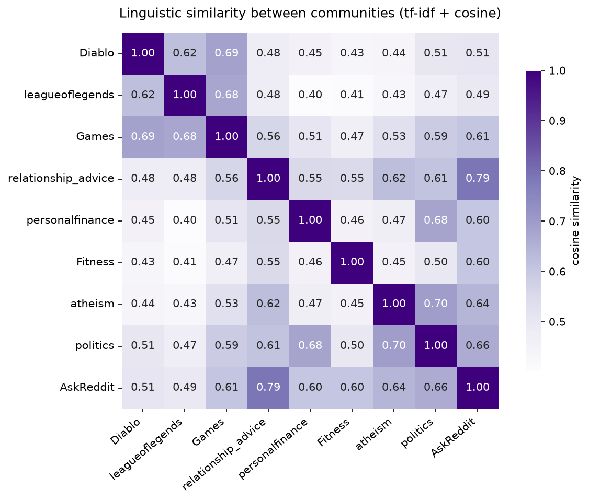
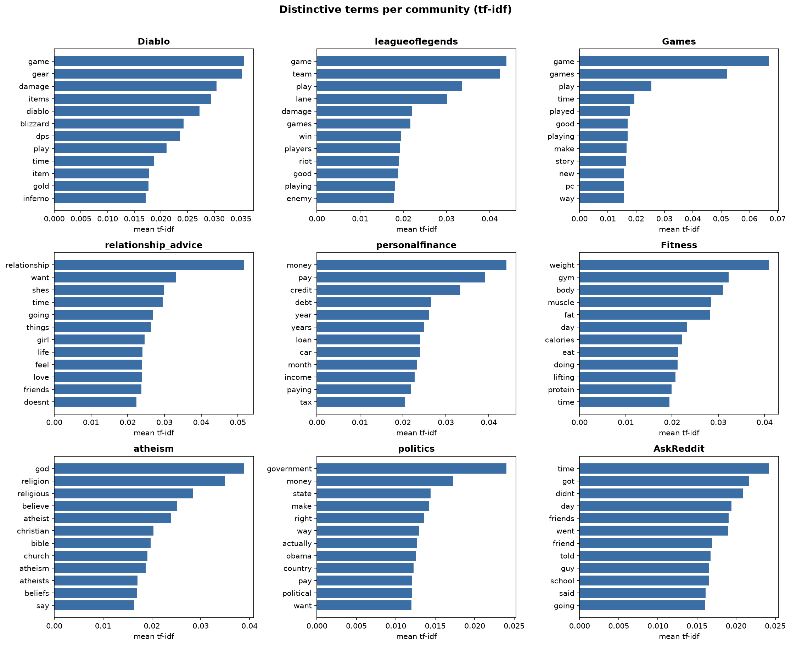
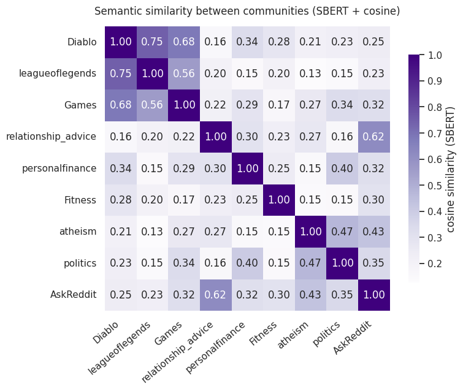
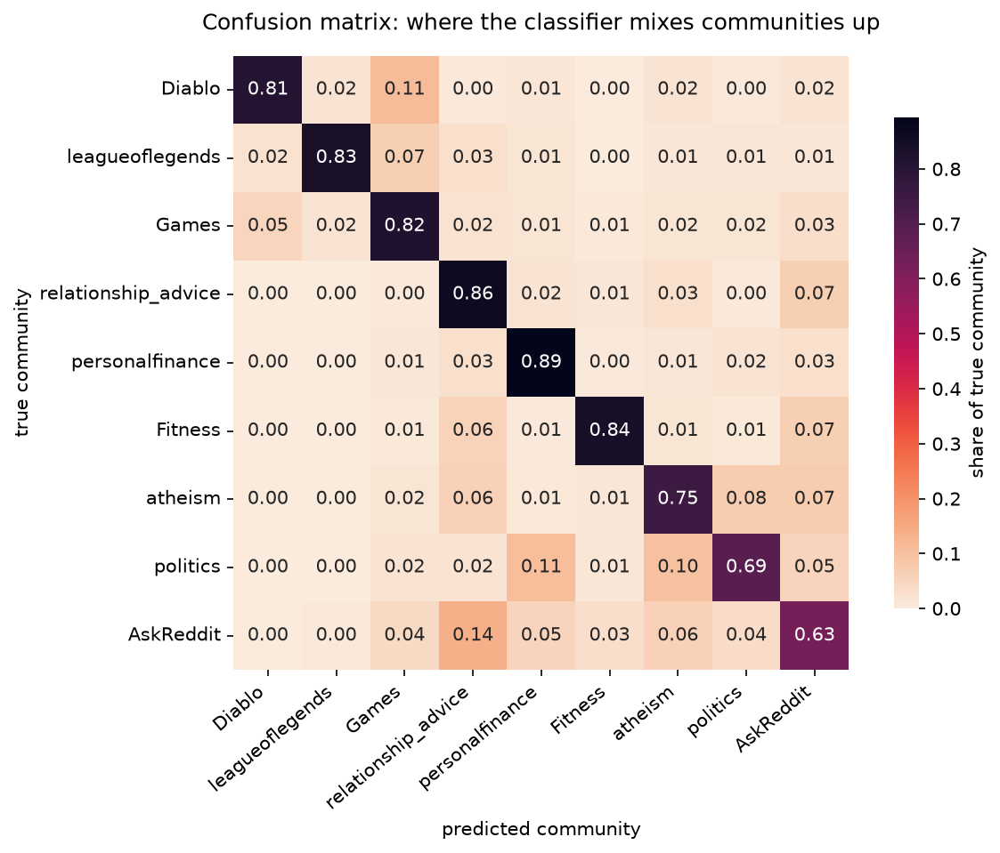

# Linguistic Fingerprints of Reddit Communities

_By Carmely Reiska, Maximilian Jaeger_

## Introduction

Online communication platforms such as Reddit offer a wide field of distinct communities that are centered around specific questions, interests, beliefs, or hobbies [1]. However, what sets these subreddits apart often goes far beyond their core themes, extending into highly distinctive writing and linguistic styles. Studying these unique writing styles via stylometry allows researchers to analyze and identify the underlying structural patterns that characterize a certain text [2]. Previous research in natural language processing has shown that stylistic features are a stronger indicator of a community than the actual content that is being discussed [1]. Furthermore, as users actively engage with these forums, their writing and linguistic styles tend to align with the dominant style of their chosen community. 

This project explores this phenomenon by quantifying the linguistic differences and common language patterns among various subreddits. By applying computational text analysis and natural language processing, we aim to map the unique stylometric features of these communities. Ultimately, we want to highlight the unique text patterns of different subreddits and find out if communities with completely unrelated topics happen to share a similar way of writing.To guide this investigation, this project addresses the following central research question:

_**How do topical Reddit communities differ in their distinctive vocabulary and linguistic style, and which communities turn out to be linguistically closest despite being thematically distant?**_

## Dataset

The foundation of this project is the Webis-TLDR-17 corpus [3], which is a large collection of roughly 3.8 million Reddit posts written between 2006 and 2016. It was originally compiled for research on abstractive summarization, where each post consists of a main text and a short author written "TL;DR". It is labelled with its subreddit, which provides a reliable ground truth for the community a certain text belongs to. Since the posts were authored by humans and filtered for bot generated content, the material reflects genuine user writing.

For our analysis we concentrate on the content field, which captures the writing style of each author, while the summaries lie outside the scope of our research question. As the full corpus is too large to process entirely, we compiled a balanced subset of nine subreddits representing four thematic clusters, namely gaming, advice and self improvement, debate and opinion, and a general purpose community as a neutral reference point. Sampling up to 2500 posts per subreddit yields roughly 22500 evenly distributed documents. One property to keep in mind is that the corpus only contains posts with a TL;DR, which favours longer submissions and slightly biases post length.

## Methods

### Setup 

All experiments were conducted using Python 3.14.4 and open-source libraries. The analysis is entirely CPU-based and runs on a standard laptop. The main dependencies are pinned in `requirements.txt`.

To set up the environment and install all dependencies, run the following commands:

```bash
git clone https://github.com/maximilian5678/docana-project-report-template.git
cd docana-project-report-template
python3 -m venv .venv
source .venv/bin/activate
pip install -r code/src/requirements.txt
```

It is then run with a single command:

```bash
cd code/src
python run.py
```

On the first run, the corpus is streamed and cached locally as `data/subset.parquet`. Subsequent runs will load the cached data instantly and save all generated figures to the `figures/` directory.

### Experiments

The experimental pipeline is reproducible and proceeds in four stages: assembling a balanced corpus, cleaning and normalising the text, deriving stylistic and semantic community profiles, and finally testing how separable the communities are with a supervised classifier. All stages are orchestrated from `run.py`, and every intermediate figure is written to the `figures/ directory`.

#### Corpus construction and sampling

Because the full Webis-TLDR-17 corpus is too large to hold in memory, it is consumed as a stream through the HuggingFace Parquet export rather than downloaded in full. As posts arrive, each one is matched against our nine target subreddits, and posts are collected into per-community buckets until every bucket holds up to 2500 documents. To avoid contaminating the profiles with empty or near-empty submissions, any post shorter than ten whitespace tokens is discarded during sampling. The ceiling of 2500 posts per subreddit was chosen to keep the corpus balanced. Since the Diablo subreddit is the rarest of the nine communities with roughly 2677 usable posts, a higher target would have forced an uneven distribution. This yields a balanced corpus of roughly 22,500 documents in which no single community dominates the vocabulary statistics. The resulting subset is cached locally as `data/subset.parquet`, so the expensive streaming step runs only once.

#### Preprocessing

For the word-level analysis, each post passes through a lightweight normalisation step. The text is lowercased, and apostrophes are removed before any other punctuation is stripped, so that contractions such as "don't" collapse into a single token "dont" rather than being split into two fragments. All remaining non-alphabetic characters are then replaced by spaces, and repeated whitespace is collapsed. This keeps the feature space restricted to alphabetic word forms and prevents digits, markup, and punctuation from introducing spurious tokens.

Stopword handling is deliberately more aggressive than the default English list. In addition to the standard scikit-learn stopwords, we remove a set of high-frequency conversational fillers (for example "people", "think", "know", "really", "would", "like", "get", together with common contraction forms such as "im", "dont", "ive", "youre", "thats"). These words appear at similar rates in almost every community and would otherwise dominate the distinctive-term rankings without carrying any discriminative signal, obscuring the vocabulary that actually distinguishes one subreddit from another.

Importantly, this cleaning is applied only to the TF-IDF branch of the analysis. The Sentence Transformer operates on the raw, unmodified post text, since transformer models rely on natural casing, punctuation, and sentence structure to build meaningful contextual representations.

#### Stylistic profiles with TF-IDF

To capture surface-level writing style, all cleaned posts are transformed with a single TF-IDF vectoriser fitted across the entire corpus. The vectoriser uses sublinear term-frequency scaling to dampen the influence of very frequent words, ignores any term that occurs in fewer than twenty documents (`min_df=20`) to suppress rare and noisy tokens, and caps the vocabulary at 20,000 features. Each post becomes a sparse TF-IDF vector, and a single profile vector per community is obtained by averaging the vectors of all its posts. Pairwise cosine similarity between these nine profiles produces the linguistic similarity matrix, in which a high value indicates that two communities draw on a similar distribution of words.

#### Distinctive terms

The same averaged TF-IDF profiles are reused to expose the vocabulary behind each similarity score. For every community, the twelve terms with the highest mean TF-IDF weight are extracted and displayed as per-community bar charts. Because the weight already accounts for how characteristic a term is relative to the rest of the corpus, these rankings act as an interpretable "fingerprint" of each subreddit and make it possible to read off why two communities end up close together or far apart.

#### Semantic profiles with SBERT

The TF-IDF view rewards shared word forms but is blind to meaning, which means two communities discussing the same concepts with different vocabulary appear dissimilar. To complement it, we embed each raw post with the pre-trained Sentence Transformer `all-MiniLM-L6-v2`, which maps a full post into a dense 384-dimensional vector that encodes its contextual meaning. Embeddings are L2-normalised at encoding time and averaged into one profile vector per community. By calculating the cosine similarity between these semantic embeddings, we create the second heatmap. Comparing it against the TF-IDF matrix is the central experiment of the project. If two communities look similar in TF-IDF but not in the semantic view, their similarity comes from a shared writing style, not from a shared topic.

#### Community separability

As a final experiment, we test whether the communities are separable in a supervised setting. The corpus is split into 75% training and 25% test data using a stratified split with a fixed random seed, so that the class balance is preserved and the result is reproducible. A dedicated TF-IDF vectoriser is fitted on the training texts alone, this time including bigrams (`ngram_range=(1, 2)`), a minimum document frequency of twenty, and a vocabulary limit of 30,000 features, in order to capture short characteristic phrases in addition to single words. A Multinomial Naive Bayes classifier is trained on these features and evaluated on the held-out test set. Beyond overall accuracy and a per-class classification report, we report a row-normalised confusion matrix, which shows the share of each true community's posts assigned to every predicted community. The off-diagonal cells reveal exactly which communities the model confuses, providing a supervised cross-check on the similarity patterns observed in the two heatmaps.

## Results and Discussion

To identify the linguistic connections between different subreddits, we evaluated the communities through two distinct lenses: word-level style patterns using a TF-IDF vectorizer, and deeper conceptual meaning using a Sentence Transformer model (**all-MiniLM-L6-v2**).

### Findings with TF-IDF

First, we calculated the cosine similarity of the subreddits' text data based on their exact word usage. The results are visualized in the similarity matrix below:



The TF-IDF matrix shows that language patterns extend far beyond just the general topic of discussion. As expected, gaming-related subreddits present a tight linguistic connection. **Diablo**, **leagueoflegends**, and **Games** all share high similarity scores ranging from 0.62 to 0.69, which is likely because they all share a common gaming vocabulary. The highest similarity in the entire dataset between two different categories is between **relationship_advice** and **AskReddit** at **0.79**. While **relationship_advice** is for specific personal topics and **AskReddit** is for general public questions, they write in a similar way by focusing heavily on personal storytelling and asking questions. We also found a strong linguistic overlap between **politics** and **atheism** (**0.70**), as well as **politics** and **personalfinance** (**0.68**). These communities deal with very different subject matters, but they share an analytical, highly opinionated, and structural way of writing. The lowest similarity score belongs to **leagueoflegends** and **personalfinance** (**0.40**), which demonstrates a clear distinction between casual video game style discussion and the professional way people discuss wealth.

### Top TF-IDF Terms

To see exactly what words are influencing these similarity scores, we looked at the top 12 most distinctive terms for each subreddit. These represent the true "fingerprints" of each community:



Looking at these specific terms gives us a few major insights. If we look closely at **AskReddit**, we see that its top words aren't about a single topic at all. Instead, they are everyday storytelling words and past-tense verbs like *got*, *didnt*, *went*, *told*, and *said*. Because **relationship_advice** also relies heavily on personal narratives (*want*, *shes*, *going*, *feel*), these two subreddits are quite connected on a stylistic level, explaining that strong 0.79 similarity score. Subreddits like **Diablo** (*gear*, *damage*, *blizzard*), **personalfinance** (*money*, *credit*, *debt*, *loan*), and **Fitness** (*weight*, *gym*, *muscle*, *calories*) are completely dominated by words specific to their themes.. This explains why they have lower similarity scores with groups outside their cluster. This shows that their daily vocabulary is highly specialized. Both **politics** and **atheism** show top words that favor abstract ideas and debate, like *right*, *way*, *actually*, *believe*, and *say*. Even though they are talking about totally different topics, they rely on similar types of argumentative words to make their points.

### SBERT

To test if these patterns hold up when looking at meaning rather than just surface-level words, we used sentence embeddings to map out each subreddit. The semantic similarities are visualized below:



By switching from word matching to analyzing underlying meaning, we uncover several new details for our data story. Firstly, the biggest change is how drastically the similarity scores dropped across completely unrelated categories. For example, the similarity between **Diablo** and **relationship_advice** reduced from 0.48 down to 0.16. This big drop actually proves our hypothesis. It shows that their earlier similarity was just because they share a casual writing style, not because they are talking about the same things.

Within the gaming category, the connection remains very strong. **Diablo** and **leagueoflegends** share a semantic similarity of **0.75** (up from 0.62 in TF-IDF). This tells us that these communities don't just use similar casual slang. They are actively discussing gaming in highly related and beyond general level of core concepts. Similarly, **relationship_advice** and **AskReddit** still maintain a high similarity of **0.62**. While lower than their style-driven TF-IDF score, this confirms that the underlying themes of these subreddits including discussion about humans, relationships, advice-seeking, and life experiences share a deep semantic foundation. Serious discussion forums like **politics** and **atheism** dropped to **0.47**. This indicates that while they share an analytical tone in TF-IDF, they are fundamentally talking about entirely distinct topics.

### Comparing Style and Meaning

Comparing both heatmaps provides a clear answer to our research question. Subreddits absolutely possess distinct "linguistic fingerprints." TF-IDF highlights how communities with completely unrelated topics can share an almost identical conversational style, while SBERT allows us to strip away that stylistic mask to see just how distinct their actual topics truly are.

### How Separable Are the Communities?

The two heatmaps show how communities relate, but not whether the differences are large enough to tell posts apart. To test this, we trained the Naive Bayes classifier described above and examined its row-normalised confusion matrix.



The strong diagonal confirms that the communities are highly separable. The classifier assigns roughly **79%** of posts to the correct subreddit, far above the 11% expected from random guessing across nine balanced classes. The most specialised communities are the easiest to identify: **personalfinance** (**0.89**), **relationship_advice** (**0.86**), and **Fitness** (**0.84**), matching their highly specific vocabulary. The three gaming subreddits are equally distinct, each between **0.81** and **0.83**.

The mistakes line up almost exactly with the overlaps from the heatmaps. **AskReddit** is the hardest to pin down (**0.63**), leaking mostly into **relationship_advice** (**0.14**), the supervised echo of their **0.79** TF-IDF similarity. **politics** is the second hardest (**0.69**) and is most often confused with **personalfinance** (**0.11**) and **atheism** (**0.10**), the same argumentative cluster from the TF-IDF view. Crucially, almost none of these confusions cross cluster boundaries. The classifier fails exactly where our similarity analysis predicted, confirming that subreddits carry distinctive fingerprints and that the few overlaps reflect a genuinely shared writing style rather than random error.


## Conclusion

Summarize the major outcomes of your project, reflect on the research findings, and clearly state the conclusions you've drawn from the study.

## Contributions

| Team Member       | Contributions                                                              |
|-------------------|---------------------------------------------------------------------------|
| Carmely Reiska    | report, TF-IDF similarity, distinctive terms, SBERT similarity, classification |
| Maximilian Jaeger | report, data loading & preprocessing, TF-IDF similarity, SBERT similarity, classification |

## References

[1] [Characterizing the Language of Online Communities and its Relation to Community Reception](https://aclanthology.org/D16-1108/) (Tran & Ostendorf, EMNLP 2016)

[2] [Using Authorship Verification to Mitigate Abuse in Online Communities](https://doi.org/10.1609/icwsm.v16i1.19359) (Weerasinghe et al., ICWSM 2022)

[3] [Webis-TLDR-17 dataset](https://huggingface.co/datasets/webis/tldr-17)
